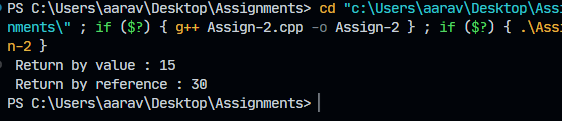
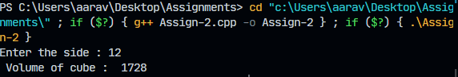
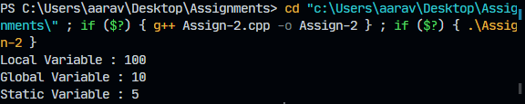
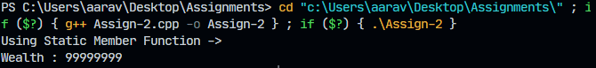
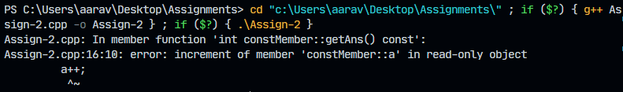
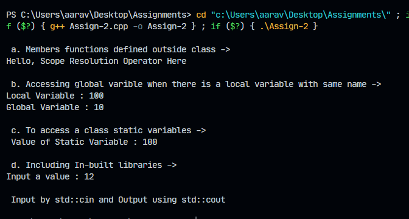

```
🤖 Hi There!

By ->

Aarav Mahajan
Roll No : 102203020
Group : CO - 2

```

# Assignment 2

### Question 1:

_Write a program to pass an object as an argument and return the object from a function._

1. _Use pass-by-value_
1. _Use pass-by-address_

```c++
#include <iostream>

using namespace std;

class A
{

public:
    int a;
};

A returnByValue(A obj)
{

    A ans;

    ans.a = obj.a + 5;

    return ans;
}

A *returnByReference(A *obj1)
{

    obj1->a *= 2;

    return obj1;
}

int main()
{

    A obj;

    obj.a = 10;

    A value = returnByValue(obj);

    cout << " Return by value : " << value.a << endl;

    // pass-by-reference 👇

    A obj1;

    obj1.a = 15;

    A* value1 = returnByReference(&obj1);

    cout << " Return by reference : " << value1->a << endl;

    return 0;
}

```



---

### Question 2:

_Write a program to define function cube() as `inline` for calculating cube._

```c++
#include <iostream>

using namespace std;


inline int cube(int side) { return side * side * side; };

int main()
{
    int side;

    cout << "Enter the side : ";

    cin >> side;

    cout << " Volume of cube :  " << cube(side) << endl;

    return 0;
}

```



---

### Question 3:

_Write a program to declare `static` public member variable, `global` and `local` variable with the same name. Initialize and display their contents._

```c++
#include <iostream>

using namespace std;


class Game
{
public:
    int example = 10;

    static int timeToComplete;

    void printValue()
    {
        int example = 100;

        cout << "Local Variable : " << example << endl;

        cout << "Global Variable : " << Game::example << endl;
    }

    static int random()
    {
        return timeToComplete;
    }
};

int Game ::timeToComplete = 5;

int main()
{
    Game hero;

    hero.printValue();

    cout << "Static Variable : " << Game::random() << endl;
}
```



---

### Question 4:

_Implement `static` member function using a C++ program._

```c++
#include <iostream>

using namespace std;

class StaticFunc
{

public:
    static int wealth;

    static int getWealth()
    {
        return wealth;
    }
};

int StaticFunc :: wealth = 99999999;

int main()
{

    cout << "Using Static Member Function ->" << endl;
    cout << "Wealth : " << StaticFunc::getWealth() << endl;

    return 0;
}

```



---

### Question 5:

_Write a C++ program to declare `const` member function and attempt any operation within it_

```c++
#include <iostream>

using namespace std;

class constMember
{

public:
    int a = 10;

    int getAns() const
    {

        a++;
        return a;
    }
};

int main()
{

    constMember example;

    example.getAns();

    return 0;
}
```



---

### Question 6:

_Create code snippets that illustrates the use of scope resolution operator `(::)` for the following uses:_
_a. Member functions defined outside class_
_b. To access a global variable when there is a local variable with same name_
_c. To access a class’s static variables_
_d. Including In-built libraries_

```c++
#include <iostream>

using namespace std;


class scopeResolutionOP
{

public:
    // global variable

    static int power;

    int timeToCompleteGame = 10;

    void fun();

    void printValue()
    {
        int timeToCompelteGame = 100;

        cout << "Local Variable : " << timeToCompelteGame << endl;

        cout << "Global Variable : " << scopeResolutionOP::timeToCompleteGame << endl;
    }
};

void scopeResolutionOP ::fun()
{
    cout << "Hello, Scope Resolution Operator Here" << endl
         << endl;
}

int scopeResolutionOP ::power = 100;

int main()
{

    scopeResolutionOP ob1;

    int input;

    cout << endl
         << " a. Members functions defined outside class -> " << endl;

    ob1.fun();

    cout << " b. Accessing global varible when there is a local variable with same name -> " << endl;

    ob1.printValue();

    cout << endl;

    cout << " c. To access a class static variables -> " << endl;

    cout << " Value of Static Variable : " << scopeResolutionOP::power << endl
         << endl;

    cout << " d. Including In-built libraries -> " << endl;

    cout << "Input a value : ";

    std::cin >> input;

    cout << endl;

    std::cout << " Input by std::cin and Output using std::cout " << endl
              << endl;

    return 0;
}
```



---
